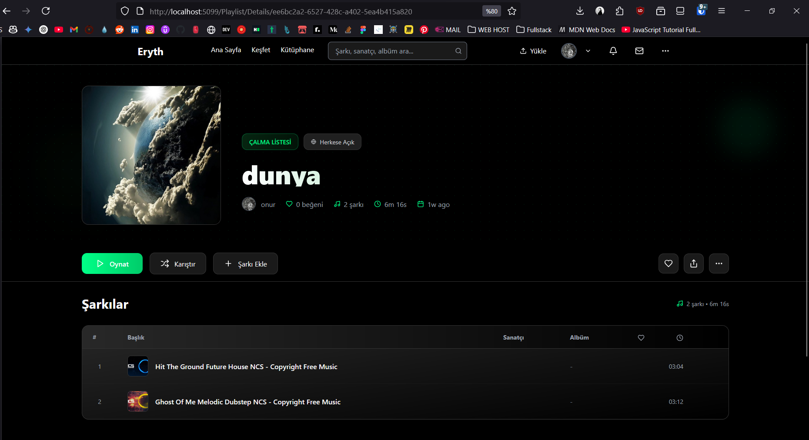
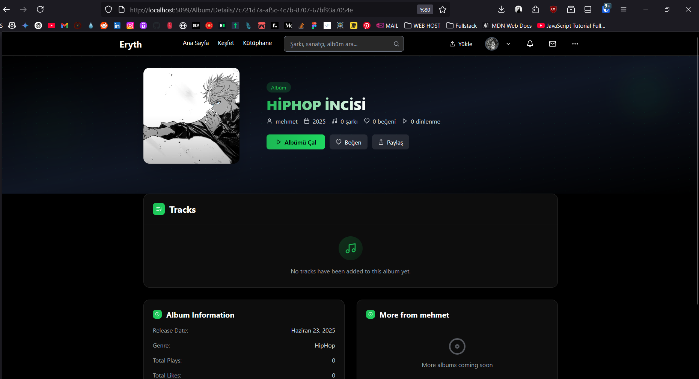
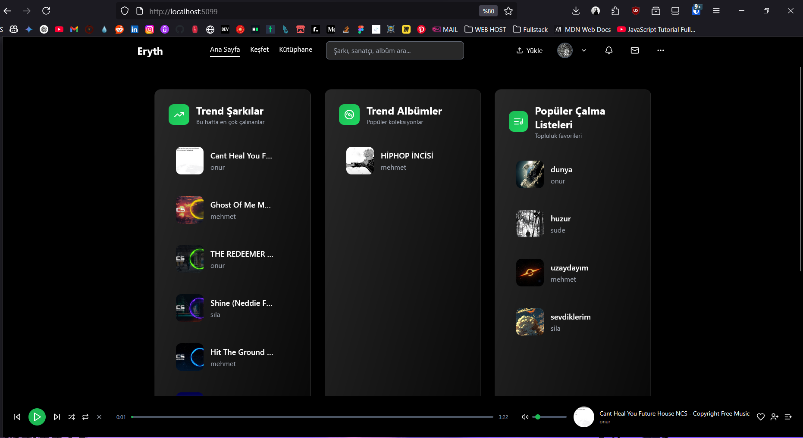
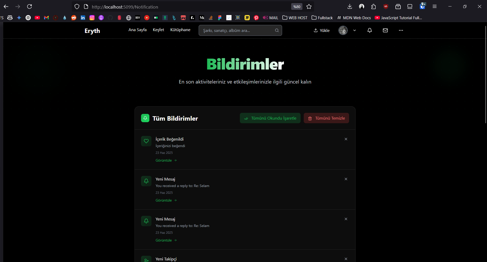
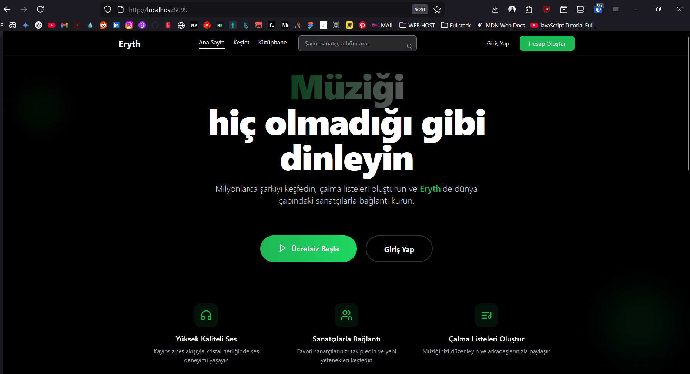
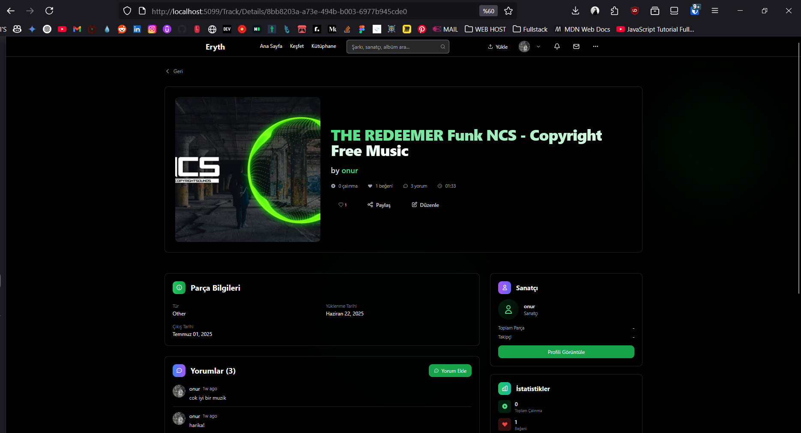
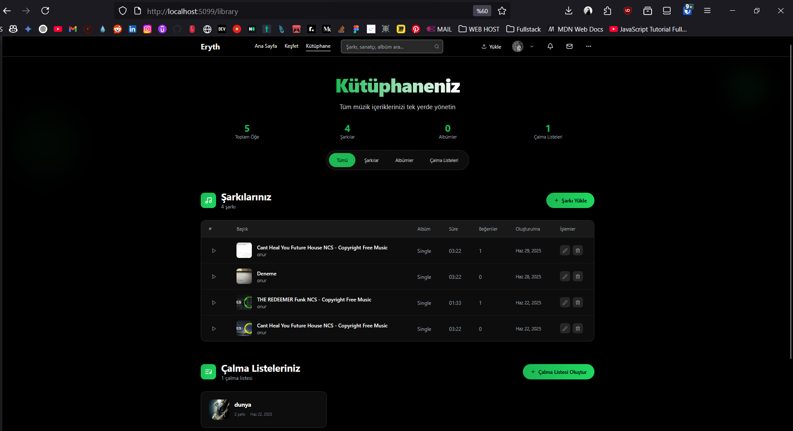
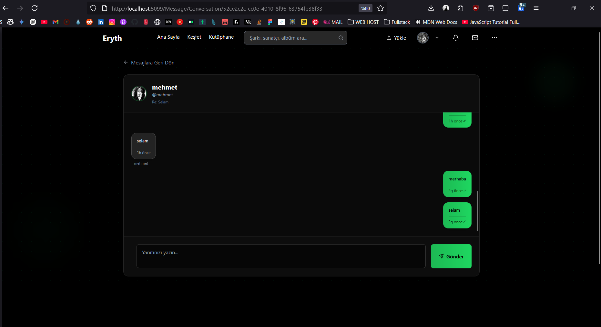
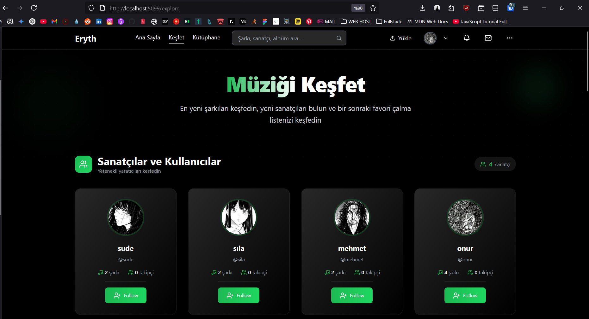

> **🤖 AI-Powered Development**: Eryth uygulamasının %90'ını yapay zeka (GitHub Copilot) ile birlikte geliştirdim.

# 🎵 Eryth - Modern Müzik Platformu

**Eryth**, ASP.NET Core ve modern web teknolojileri kullanılarak geliştirilmiş kapsamlı bir müzik streaming ve paylaşım platformudur. Kullanıcılar müzik yükleyebilir, çalma listeleri oluşturabilir, diğer kullanıcıları takip edebilir ve sosyal etkileşimde bulunabilir.

## 📋 İçindekiler

- [Proje Hakkında](#proje-hakkında)
- [Özellikler](#özellikler)
- [Ekran Görüntüleri](#ekran-görüntüleri)
- [Teknolojiler](#teknolojiler)
- [Kurulum](#kurulum)
- [Proje Yapısı](#proje-yapısı)
- [Detaylı Yapı Açıklamaları](#detaylı-yapı-açıklamaları)
- [Backend Mimarisi](#backend-mimarisi)
- [Frontend Teknolojileri](#frontend-teknolojileri)
- [Veritabanı Yapısı](#veritabanı-yapısı)
- [API Endpointleri](#api-endpointleri)
- [Katkıda Bulunma](#katkıda-bulunma)
- [Lisans](#lisans)

## 🎯 Proje Hakkında

### Projenin Konusu

Eryth, kullanıcıların müzik yükleyebileceği, keşfedebileceği ve paylaşabileceği modern bir müzik platformudur. Spotify, SoundCloud benzeri platformlardan ilham alınarak geliştirilmiştir.

### Projenin Amacı

- Müzisyenlerin eserlerini kolayca yükleyip paylaşabilmeleri
- Kullanıcıların müzik keşfetmesi ve kişiselleştirilmiş deneyim yaşaması
- Sosyal müzik deneyimi (takip etme, beğenme, yorum yapma)
- Modern ve kullanıcı dostu arayüz sunması
- Güvenli ve ölçeklenebilir bir platform oluşturması

### Temel Özellikler

- 🎵 Müzik yükleme ve streaming
- 📝 Çalma listesi oluşturma ve yönetimi
- 👥 Kullanıcı takip sistemi
- ❤️ Beğeni ve yorum sistemi
- 🔍 Gelişmiş arama ve keşif
- 📧 Mesajlaşma sistemi
- 🔔 Bildirim sistemi
- 👤 Kullanıcı profil yönetimi
- 📊 Admin paneli
- 🌐 Çoklu dil desteği (TR/EN)

## ✨ Özellikler

### 🎵 Müzik Yönetimi
- Yüksek kaliteli müzik yükleme ve streaming
- Otomatik metadata çıkarma
- Çoklu format desteği (MP3, WAV, vb.)
- Gelişmiş müzik çalar

### 👥 Sosyal Özellikler
- Kullanıcı takip sistemi
- Gerçek zamanlı mesajlaşma
- Yorum ve beğeni sistemi
- Bildirim yönetimi

### 📊 Keşif ve Arama
- Akıllı arama algoritması
- Trend müzikler
- Kategoriye göre filtreleme
- Kişiselleştirilmiş öneriler

### 🎛️ Yönetim Paneli
- Kapsamlı admin kontrolü
- Kullanıcı yönetimi
- İçerik moderasyonu
- Analitik dashboard

## 📸 Ekran Görüntüleri

### Ana Sayfa ve Müzik Çalar


### Keşif Sayfası


### Kullanıcı Profili


### Çalma Listeleri


### Müzik Yükleme


### Arama ve Filtreleme


### Mesajlaşma Sistemi


### Admin Paneli


### Mobil Görünüm


*Daha fazla ekran görüntüsü için [screenshots](./screenshots) klasörünü inceleyebilirsiniz.*

## ⚙️ Teknolojiler

### Backend Teknolojileri

- **ASP.NET Core 8.0** - Ana framework
- **Entity Framework Core 9.0.5** - ORM
- **SQL Server** - Veritabanı
- **Cookie Authentication** - Kimlik doğrulama
- **NAudio 2.2.1** - Ses dosyası işleme
- **Memory Cache** - Önbellekleme
- **SMTP** - E-posta servisi

### Frontend Teknolojileri

- **Razor Pages & MVC** - Server-side rendering
- **Tailwind CSS 3.4.0** - CSS framework
- **JavaScript ES6+** - İstemci tarafı etkileşimler
- **HTML5 Audio API** - Müzik çalar
- **Lucide Icons** - İkon kütüphanesi
- **CSS Grid & Flexbox** - Layout sistemleri

### Geliştirme Araçları

- **Visual Studio / VS Code**
- **Git** - Versiyon kontrolü
- **npm** - Paket yöneticisi
- **Entity Framework Migrations** - Veritabanı migrasyonları

## 🚀 Kurulum

### Gereksinimler

- .NET 8.0 SDK
- SQL Server (LocalDB veya SQL Server Express)
- Node.js (Tailwind CSS için)
- Visual Studio 2022 veya VS Code

### Adım Adım Kurulum

1. **Projeyi İndirin**

   ```bash
   # ZIP dosyasını indirip çıkarın veya
   git clone [repository-url]
   cd Eryth
   ```

2. **Bağımlılıkları Yükleyin**

   ```bash
   # .NET paketlerini yükle
   dotnet restore
   
   # Node.js paketlerini yükle (Tailwind CSS için)
   npm install
   ```

3. **Veritabanını Hazırlayın**

   ```bash
   # Migrations uygula
   dotnet ef database update
   ```

4. **Konfigürasyon Ayarları**

   - `appsettings.json` dosyasında veritabanı bağlantı dizesini kontrol edin
   - E-posta ayarlarını yapılandırın (opsiyonel)

5. **CSS Build**

   ```bash
   # Tailwind CSS build
   npm run build-css
   ```

6. **Uygulamayı Çalıştırın**

   ```bash
   dotnet run
   ```

7. **Tarayıcıda Açın**

   - <https://localhost:7000> adresine gidin

### Test Verisi

Geliştirme ortamında otomatik olarak test kullanıcısı ve müzik verileri oluşturulur:

- **Kullanıcı:** mehmet / test@test.com

## 📁 Proje Yapısı

```text
Eryth/
├── 📁 Controllers/          # MVC Controllers
├── 📁 Data/                # Entity Framework DbContext
├── 📁 Extensions/          # Service Extensions & DI
├── 📁 Infrastructure/      # External Services (Email, File Upload)
├── 📁 Migrations/          # Entity Framework Migrations
├── 📁 Models/              # Domain Models & Entities
│   └── 📁 Enums/          # Enum Definitions
├── 📁 Properties/          # Project Properties
├── 📁 Resources/           # Localization Files
├── 📁 Services/            # Business Logic Services
├── 📁 Utilities/           # Helper Classes
├── 📁 ViewComponents/      # Razor View Components
├── 📁 ViewModels/          # Data Transfer Objects
├── 📁 Views/               # Razor Views
│   └── 📁 Shared/         # Shared Views & Layouts
└── 📁 wwwroot/            # Static Files
    ├── 📁 css/            # Stylesheets
    ├── 📁 js/             # JavaScript Files
    ├── 📁 lib/            # Third-party Libraries
    └── 📁 uploads/        # User Uploaded Files
```

## 🏗️ Detaylı Yapı Açıklamaları

### 📂 Controllers (Denetleyiciler)

MVC pattern'ının temel bileşenleri. HTTP isteklerini karşılar ve iş mantığını yönetir.

- **HomeController.cs** - Ana sayfa, dashboard ve genel sayfalar
- **AuthController.cs** - Kimlik doğrulama (giriş/çıkış/kayıt)
- **TrackController.cs** - Müzik yükleme, düzenleme, silme
- **UserController.cs** - Kullanıcı profil yönetimi
- **PlaylistController.cs** - Çalma listesi operasyonları
- **SearchController.cs** - Arama ve filtreleme
- **AlbumController.cs** - Albüm yönetimi
- **CommentController.cs** - Yorum sistemi
- **LikesController.cs** - Beğeni sistemi
- **MessageController.cs** - Mesajlaşma
- **NotificationController.cs** - Bildirimler
- **AdminController.cs** - Yönetim paneli
- **ApiController.cs** - RESTful API endpoint'leri
- **BaseController.cs** - Ortak controller fonksiyonları

### 📂 Data (Veri Katmanı)

Entity Framework Core ile veritabanı işlemlerini yönetir.

- **ApplicationDbContext.cs** - Ana DbContext sınıfı
  - Tüm entity'lerin DbSet tanımları
  - Model yapılandırmaları
  - Otomatik timestamp güncelleme
  - Soft delete implementasyonu

### 📂 Extensions (Genişletmeler)

Dependency Injection ve servis konfigürasyonları.

- **ServiceExtensions.cs** - DI container konfigürasyonu
  - Business service kayıtları
  - Infrastructure service kayıtları
  - Email ve file upload konfigürasyonları

### 📂 Infrastructure (Altyapı Servisleri)

Dış servisler ve altyapı bileşenleri.

- **IFileUploadService.cs / LocalFileUploadService.cs** - Dosya yükleme
- **IEmailService.cs / SmtpEmailService.cs** - E-posta gönderimi
- **ICacheService.cs / MemoryCacheService.cs** - Önbellekleme

### 📂 Models (Domain Modelleri)

İş mantığının temel veri yapıları.

**Ana Entityler:**

- **User.cs** - Kullanıcı bilgileri, profil, ayarlar
- **Track.cs** - Müzik dosyaları ve metadata
- **Album.cs** - Albüm bilgileri
- **Playlist.cs** - Çalma listeleri
- **Comment.cs** - Yorum sistemi
- **Like.cs** - Beğeni sistemi
- **Follow.cs** - Takip sistemi
- **Message.cs** - Mesajlaşma
- **Notification.cs** - Bildirimler
- **Report.cs** - Şikayet sistemi

**Enums:**

- **Genre.cs** - Müzik türleri
- **TrackStatus.cs** - Müzik durumları
- **UserRole.cs** - Kullanıcı rolleri
- **AccountStatus.cs** - Hesap durumları
- **NotificationType.cs** - Bildirim türleri

### 📂 Services (İş Mantığı Servisleri)

Business logic katmanı. Her domain için ayrı servis.

- **IUserService.cs / UserService.cs** - Kullanıcı operasyonları
- **ITrackService.cs / TrackService.cs** - Müzik operasyonları
- **IPlaylistService.cs / PlaylistService.cs** - Çalma listesi işlemleri
- **IAuthService.cs / AuthService.cs** - Kimlik doğrulama
- **ISearchService.cs / SearchService.cs** - Arama ve filtreleme
- **INotificationService.cs / NotificationService.cs** - Bildirim yönetimi

### 📂 Utilities (Yardımcı Sınıflar)

Ortak kullanılan yardımcı fonksiyonlar.

- **AudioHelper.cs** - Ses dosyası işlemleri (NAudio kullanarak)
- **FileHelper.cs** - Dosya operasyonları
- **SecurityHelper.cs** - Güvenlik fonksiyonları
- **ValidationHelper.cs** - Veri doğrulama
- **DateTimeHelper.cs** - Tarih/saat işlemleri

### 📂 ViewModels (Veri Transfer Objeleri)

Controller ve View arasında veri transferi için.

- **TrackViewModel.cs** - Müzik görüntüleme modeli
- **UserProfileViewModel.cs** - Kullanıcı profil modeli
- **PlaylistViewModel.cs** - Çalma listesi modeli
- **SearchViewModel.cs** - Arama sonuçları
- **DashboardViewModel.cs** - Ana sayfa modeli

### 📂 Views (Razor Görünümleri)

Server-side rendering ile kullanıcı arayüzü.

**Klasör Yapısı:**

- **Home/** - Ana sayfa ve genel sayfalar
- **Auth/** - Giriş/kayıt sayfaları
- **Track/** - Müzik yükleme/görüntüleme
- **User/** - Profil sayfaları
- **Playlist/** - Çalma listesi sayfaları
- **Search/** - Arama sayfaları
- **Shared/** - Ortak layout ve component'ler

### 📂 ViewComponents (Razor Bileşenleri)

Yeniden kullanılabilir UI bileşenleri.

- **FollowButtonViewComponent.cs** - Takip butonu
- **LikeButtonViewComponent.cs** - Beğeni butonu
- **UserProfileImageViewComponent.cs** - Profil resmi

### 📂 wwwroot (Statik Dosyalar)

İstemci tarafı kaynakları.

**CSS:**

- **input.css** - Tailwind CSS kaynak dosyası
- **output.css** - Derlenmiş CSS
- **audioPlayer.css** - Müzik çalar stilleri
- **site.css** - Özel stiller

**JavaScript:**

- **audioPlayer.js** - Müzik çalar functionality (1169+ satır)
- **site.js** - Genel site fonksiyonları
- **search-suggest.js** - Arama önerileri
- **follow-toggle.js** - Takip butonu etkileşimi
- **like-toggle.js** - Beğeni butonu etkileşimi

## 🎵 Backend Mimarisi

### Katmanlı Mimari

1. **Presentation Layer** - Controllers & Views
2. **Business Logic Layer** - Services
3. **Data Access Layer** - Entity Framework & DbContext
4. **Infrastructure Layer** - External Services

### Design Patterns

- **Repository Pattern** - Entity Framework ile
- **Dependency Injection** - ASP.NET Core DI Container
- **Service Layer Pattern** - Business logic ayrımı
- **ViewModel Pattern** - Data transfer için

### Güvenlik

- **Cookie-based Authentication**
- **CSRF Protection** - Anti-forgery tokens
- **Input Validation** - Data annotations
- **Rate Limiting** - Brute force koruması
- **File Upload Security** - Dosya türü validasyonu

## 🎨 Frontend Teknolojileri

### CSS Framework

- **Tailwind CSS 3.4.0** - utility-first CSS framework
- **@tailwindcss/forms** - Form styling
- **@tailwindcss/typography** - Typography plugin

### JavaScript Özellikleri

- **ES6+ Syntax** - Modern JavaScript
- **HTML5 Audio API** - Müzik çalar
- **Fetch API** - AJAX istekleri
- **Local Storage** - İstemci tarafı veri saklama
- **Event Delegation** - Performanslı event handling

### UI/UX Özellikleri

- **Responsive Design** - Mobil uyumlu
- **Dark Theme** - Modern görünüm
- **Smooth Animations** - CSS transitions & animations
- **Loading States** - Skeleton loading
- **Progressive Enhancement** - İşlevsellik kademeli artışı

## 🗄️ Veritabanı Yapısı

### Ana Tablolar

- **Users** - Kullanıcı bilgileri
- **Tracks** - Müzik dosyaları
- **Albums** - Albüm bilgileri
- **Playlists** - Çalma listeleri
- **PlaylistTracks** - Çalma listesi-müzik ilişkisi

### İlişki Tabloları

- **Follows** - Kullanıcı takip ilişkisi
- **Likes** - Beğeni ilişkisi
- **Comments** - Yorum sistemi
- **Messages** - Mesajlaşma
- **Notifications** - Bildirimler

### Özellikler

- **Soft Delete** - Veri güvenliği için
- **Audit Fields** - CreatedAt, UpdatedAt
- **Indexing** - Performans optimizasyonu
- **Foreign Key Constraints** - Veri bütünlüğü

## 📡 API Endpointleri

### Authentication

- `POST /Auth/Login` - Kullanıcı girişi
- `POST /Auth/Register` - Kullanıcı kaydı
- `POST /Auth/Logout` - Çıkış yapma

### Tracks

- `GET /Track` - Müzik listesi
- `POST /Track/Upload` - Müzik yükleme
- `GET /Track/Details/{id}` - Müzik detayları
- `DELETE /Track/Delete/{id}` - Müzik silme

### Playlists

- `GET /Playlist` - Çalma listeleri
- `POST /Playlist/Create` - Çalma listesi oluşturma
- `PUT /Playlist/Edit/{id}` - Çalma listesi düzenleme

### User Management

- `GET /User/Profile/{username}` - Kullanıcı profili
- `PUT /User/Edit` - Profil düzenleme
- `POST /User/Follow` - Kullanıcı takip etme

## 🔧 Geliştirme Notları

### Test Verisi

Geliştirme ortamında `TestDataSeeder.cs` ile otomatik test verisi oluşturulur.

### Konfigürasyon

- `appsettings.json` - Genel ayarlar
- `appsettings.Development.json` - Geliştirme ayarları

### Cache Stratejisi

- Memory cache kullanılır
- Kullanıcı oturumları cache'lenir
- Trending müzikler cache'lenir

## 🤝 Katkıda Bulunma

Projeye katkıda bulunmak istiyorsanız:

1. Bu repository'yi fork edin
2. Yeni bir branch oluşturun (`git checkout -b feature/yeni-ozellik`)
3. Değişikliklerinizi commit edin (`git commit -am 'Yeni özellik eklendi'`)
4. Branch'inizi push edin (`git push origin feature/yeni-ozellik`)
5. Pull Request oluşturun

### Geliştirme Kuralları

- Kod standardlarına uyun
- Test yazın
- Commit mesajlarını açıklayıcı yazın
- Pull Request'te değişiklikleri detaylandırın

## � Lisans

Bu proje MIT lisansı altında lisanslanmıştır. Detaylar için [LICENSE](LICENSE) dosyasını inceleyebilirsiniz.

## 👨‍💻 Geliştirici

- **mrctnd** - *Full-Stack Developer*

## 🙏 Teşekkürler

Bu projenin geliştirilmesinde ilham alınan kaynaklar:
- Spotify - Müzik streaming deneyimi
- SoundCloud - Müzik paylaşım platformu
- YouTube Music - Kullanıcı arayüzü

---

**Eryth** - Modern müzik deneyiminin yeni adresi 🎵

*Eğer bu projeyi beğendiyseniz, ⭐ vermeyi unutmayın!*
