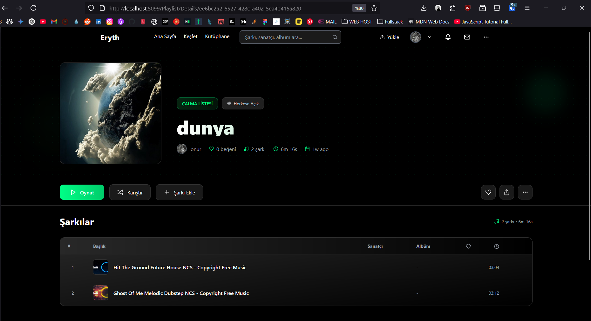
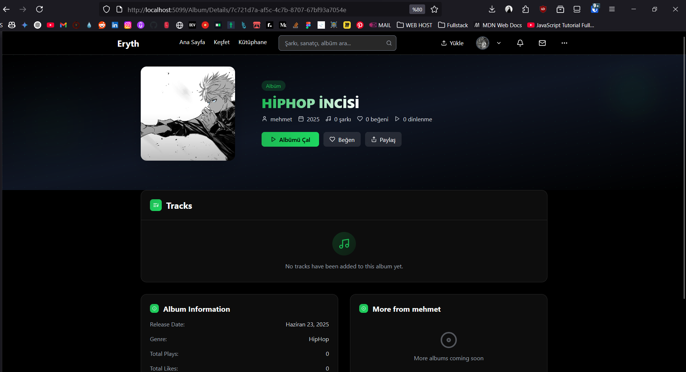
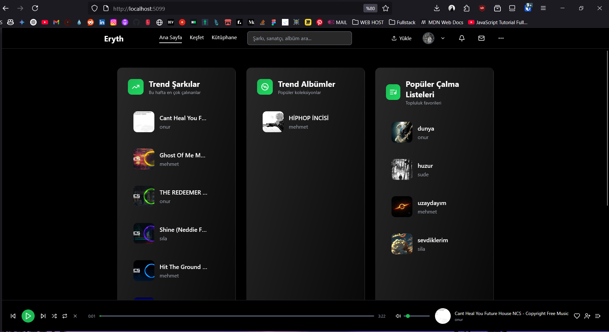
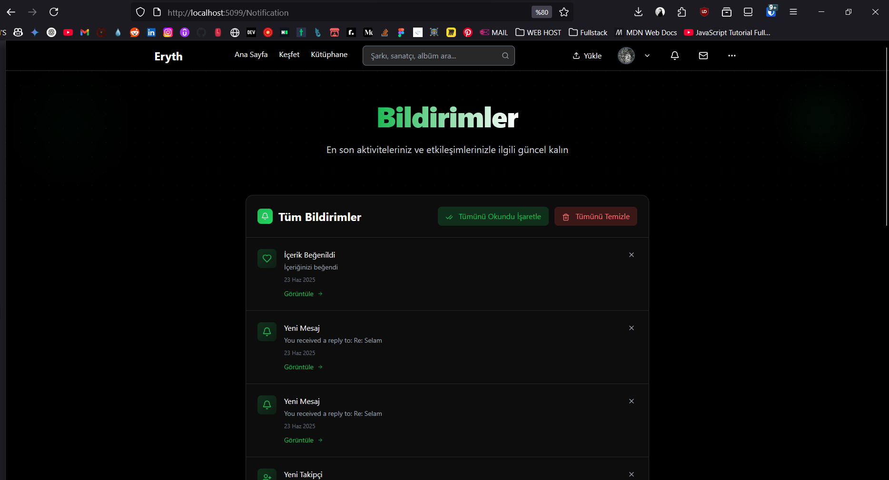
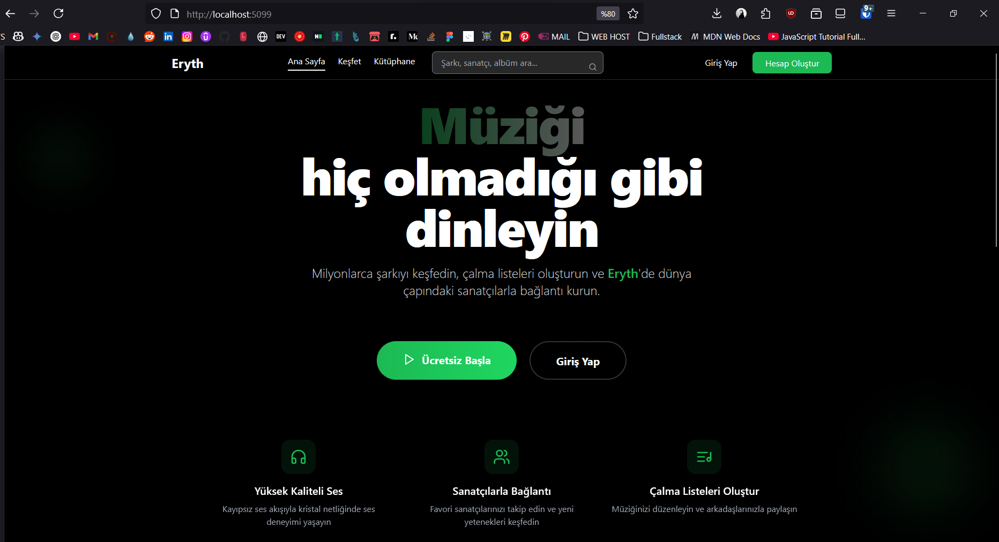
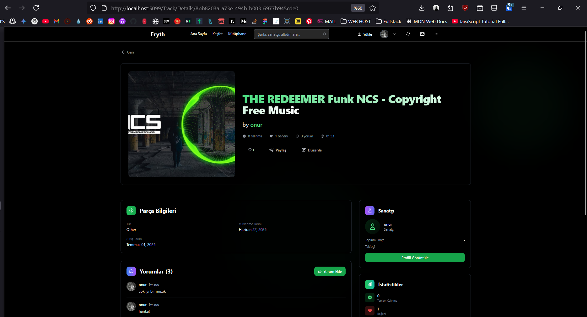
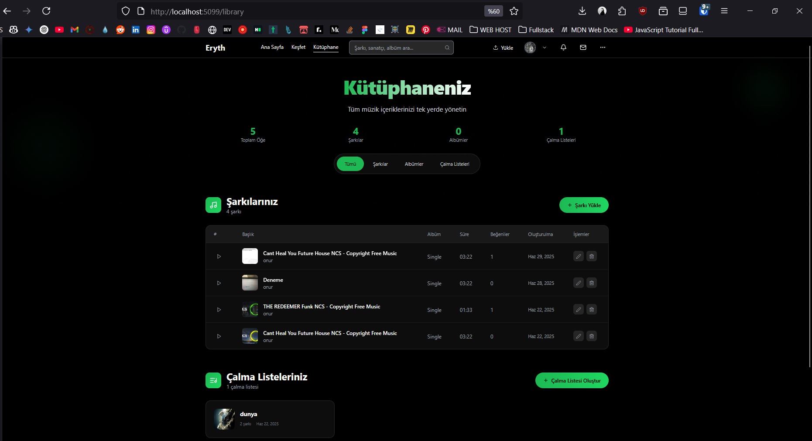
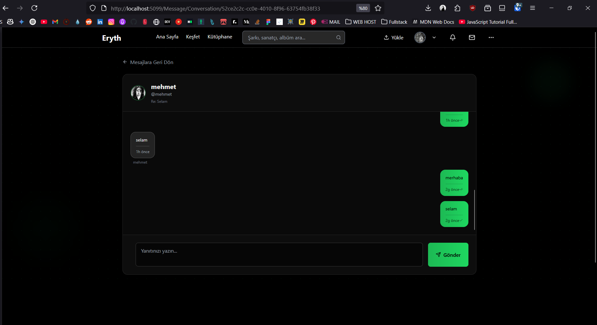
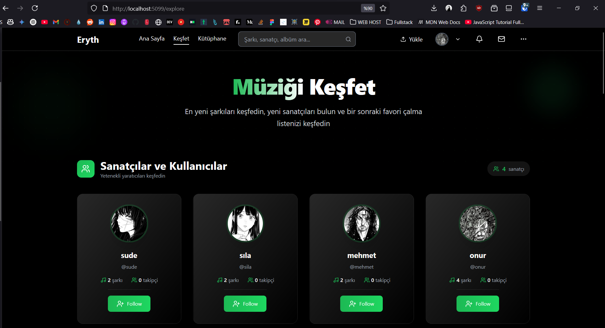

> **🤖 AI-Powered Development**: Over 90% of Eryth was developed in collaboration with AI (GitHub Copilot).

# 🎵 Eryth — Modern Music Streaming Platform

**Eryth** is a comprehensive music streaming and sharing platform built with ASP.NET Core and modern web technologies. Users can upload their own tracks, curate playlists, follow other users, and engage in a rich social music experience.

## 📋 Table of Contents

- [About the Project](#-about-the-project)
- [Key Features](#-key-features)
- [Screenshots](#-screenshots)
- [Tech Stack](#-tech-stack)
- [Getting Started](#-getting-started)
- [Project Architecture](#-project-architecture)
- [Database Structure](#-database-structure)
- [API Endpoints](#-api-endpoints)
- [Contributing](#-contributing)
- [License](#-license)

---

## 🎯 About the Project

### Concept
Eryth is a modern platform designed for discovering, streaming, and sharing music. Taking inspiration from industry giants like Spotify and SoundCloud, Eryth provides a space for upcoming artists and listeners to connect.

### Main Objectives
- Provide musicians with an easy-to-use platform to upload and share their work.
- Help users discover new music through a personalized experience.
- Build a strong community through social features (following, liking, commenting).
- Deliver a sleek, modern, and responsive user interface.
- Maintain a secure, scalable, and high-performance backend architecture.

---

## ✨ Key Features

### 🎵 Music Management
- High-quality audio streaming & uploading.
- Automatic metadata extraction from audio files.
- Support for multiple audio formats (MP3, WAV, etc.).
- Advanced, persistent custom audio player.

### 👥 Social Experience
- Follow / Unfollow user system.
- Real-time messaging between users.
- Like and comment on tracks and playlists.
- Comprehensive notification system.

### 🔍 Discovery & Search
- Smart search algorithms for tracks, albums, and users.
- Trending and popular music algorithms.
- Genre-based categorizations.
- Personalized music recommendations.

### 🎛️ Admin Dashboard
- Comprehensive admin control panel.
- User and content moderation.
- Analytics and platform statistics dashboard.

---

## 📸 Screenshots

*(Paths reflect the `screenshots/` directory. Replace placeholders if necessary)*

### Home & Audio Player


### Discovery Page


### User Profile


### Playlists


### Music Upload


### Search & Filters


### Messaging System


### Admin Panel


### Mobile Responsive Design


---

## ⚙️ Tech Stack

### Backend
- **Framework:** ASP.NET Core 8.0 (MVC)
- **ORM:** Entity Framework Core 9.0.5
- **Database:** MSSQL (SQL Server)
- **Auth:** Cookie-based Authentication
- **Audio Processing:** NAudio 2.2.1
- **Caching:** In-Memory Cache
- **Email Delivery:** SMTP Configuration

### Frontend
- **UI Architecture:** Razor Pages & MVC (Server-side rendering)
- **Styling:** Tailwind CSS 3.4.0 (Utility-first CSS)
- **Interactivity:** Vanilla JavaScript (ES6+)
- **Audio:** HTML5 Audio API
- **Icons:** Lucide Icons

---

## 🚀 Getting Started

### Prerequisites
- [.NET 8.0 SDK](https://dotnet.microsoft.com/download/dotnet/8.0)
- SQL Server (LocalDB or SQL Server Express)
- Node.js (Required for building Tailwind CSS)
- Visual Studio 2022 or VS Code

### Installation Process

1. **Clone the repository**
   ```bash
   git clone https://github.com/mrctnd/Eryth.git
   cd Eryth
   ```

2. **Restore Dependencies**
   ```bash
   dotnet restore
   npm install
   ```

3. **Database Setup**
   Ensure your connection string in `appsettings.json` points to your SQL instance.
   ```bash
   dotnet ef database update
   ```

4. **Build CSS Assets**
   ```bash
   npm run build-css
   ```

5. **Run the Application**
   ```bash
   dotnet run
   ```
   *Navigate to `https://localhost:7000` (or the port defined in `launchSettings.json`).*

> **Note on Test Data:** In development mode, the `TestDataSeeder` automatically generates mock users, tracks, and playlists. 
> Default login: `test@test.com` (Username: `mehmet`)

---

## 🏗️ Project Architecture

Eryth follows a clean, decoupled **N-Tier Architecture** implementation utilizing the Repository and Service patterns.

### Core Structure
```text
Eryth/
├── Controllers/          # Handles HTTP requests & routing
├── Data/                 # EF Core DbContext & Configurations
├── Extensions/           # Service Extensions & Dependency Injection
├── Infrastructure/       # External Integrations (Files, Email)
├── Models/               # Domain Entities & Enums
├── Services/             # Business Logic Layer
├── ViewComponents/       # Reusable Razor UI Components
├── ViewModels/           # DTOs for View-to-Controller data transfer
├── Views/                # Razor markup pages
└── wwwroot/              # Static Assets (CSS, JS, Uploads)
```

### Security Measures
- **Anti-Forgery:** Built-in CSRF protection via tokens.
- **Data Validation:** Strict input validation using Data Annotations.
- **Rate Limiting:** Protection against Brute Force attacks.
- **Encrypted Media:** Secure handling and storage of uploaded audio files.

---

## 🗄️ Database Structure

Managed via **Entity Framework Core**, utilizing a highly relational structure.

- **Users:** Manages profiles, authentication, and roles.
- **Tracks / Albums:** Stores audio metadata, file paths, and ownership.
- **Playlists & PlaylistTracks:** Many-to-Many relationships for dynamic playlists.
- **Social Tables:** `Follows`, `Likes`, `Comments`, `Messages`, `Notifications`.
- **Soft Delete Pattern:** Implemented globally for data recovery and integrity.

---

## 📡 Key API Endpoints

### Authentication
- `POST /Auth/Login` - Authenticate user
- `POST /Auth/Register` - Create a new account
- `POST /Auth/Logout` - Terminate session

### Track Operations
- `GET /Track` - Fetch catalog of tracks
- `POST /Track/Upload` - Process and save uploaded audio
- `DELETE /Track/Delete/{id}` - Safely remove a track

### User & Social Interactions
- `POST /User/Follow` - Toggle follow status for a user
- `POST /Likes/Toggle` - Like/Unlike a specific track or playlist
- `GET /User/Profile/{username}` - Retrieve a user's public profile

---

## 🤝 Contributing

Contributions are always welcome! If you have a suggestion that would make Eryth better:

1. Fork the Project.
2. Create your Feature Branch (`git checkout -b feature/AmazingFeature`).
3. Commit your Changes (`git commit -m 'Add some AmazingFeature'`).
4. Push to the Branch (`git push origin feature/AmazingFeature`).
5. Open a Pull Request.

---

## 📄 License

Distributed under the MIT License. See `LICENSE` file for more information.

---

### Developed by [mrctnd](https://github.com/mrctnd)
*Inspired by the seamless experiences of Spotify and SoundCloud.*
